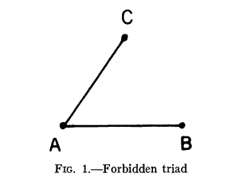

# The Strength of Weak Ties
---
With this I'm hoping to read through scientific papers in a variety of fields, and take notes detailing what the author(s) said in the paper, and frame it in a way that makes it easier to understand. I'll be primarily looking at papers that are important for my own work, and perhaps some that I have to read for classes. I'll assume no background on your part. Except perhaps some familiarity with computation. Nothing more than what you would get from CompSci 101. But first and foremost this is a way for me to comprehend and contextualize papers for myself. me, me, me. 

This first paper is the Strength of Weak Ties, written by Mark Granovetter in 1973. Now a professor at Stanford, he is best known for his work in social network theory and economic sociology. In particular, he's best known for his theory about how information spreads in social networks, first spelled out in this paper.

If you didn't know, I'm coming from a biological and computer science background. I spent a few years working in a computational social science lab before starting my PhD, and during that learned a lot about the scope of the social sciences. It's never not fascinating how continuous the spectrum of "quantitativeness" the social sciences are, especially something like sociology. I hope I can impart some of that fascination and passion to you. 

---
### Background

First and foremost– *what is a social network?* 

I think the easiest way to understand it is in terms of social media. FaceBook. Twitter. Mastodon. Digg.  Social networks are the ways we organize ourselves on these platforms, but it's also how we organize in the real world too: you, your friends, and everyone around you are nodes on a graph, and those nodes are connected by how you know or talk to each other. You are in a social network if you follow people on Twitter. You are in a social network of all the friends you have on Facebook (and all the friends they have, so on and so forth). You and your extended family make up a social network. But so do you and the person next to you at the laundromat. You may not know each other, but you could be connected simply by virtue of living in the same neighborhood and maybe just greeting each other.

So how can we define how people relate to each other? 

In mathematical sociology, **interpersonal ties** are defined as information-carrying connections between people. They can come in three varieties:

* Strong
* Weak
* Absent

As it's spelled out in the paper, the strength of these ties can be roughly treated as a combination of factors including time invested, intimacy, reciprocity, etc. I won't speak for you, but these are definitely factors that are intuitive for me as being important in understanding my relationships with other people. 

---
###Significance
* Proposed a network analysis framework that would allow for connecting micro-level sociological theory to macro-level sociological theory 
    * Micro-level sociology looks at the dynamics of small groups of people, like friendships, etc
    * Macro-level sociology looks at things like community organization, political structure, social mobility
* Adds to the understanding of how small interpersonal relationships inform large-scale patterns, and how those patterns turn around and inform these relationships
* At the time this kind of network analysis was found only in social psychology circles, when it could be generalized to other problems and disciplines as well

* Fundamentally a qualitative paper that presents a limited aspect of this kind of network analysis (strength of interpersonal ties)

### The Strength of Ties
* Assuming positive and symmetric ties, the strength of a tie is intuited as a linear combo of:
    * amount of time
    * emotional intensity
    * intimacy
    * reciprocal services
* Assume individuals A & B. Assume the set S of individuals with ties to either or both A & B. 
* The key hypothesis that lets us tie dyadic ties to larger structures is that the stronger the tie between A & B, the larger the proportion of individuals in S to whom they will *both* be tied, either by a weak or strong tie. 
* The intuition is that even if B and C, who have strong ties to A, have no relationship to one another, the common strong ties to A will probably bring them into interaction and generate one.

### Weak Ties in Diffusion Processes

* Given the hypothesis, we should never see the "forbidden triad":

    
    
* At the time of writing there was some evidence for the absence of the triad. 
* The absence can be explained by the concept of the "bridge": the line in a network which provides the **only** path between two points. 
    * To elaborate, a bridge between A and B provides the only route along which information or influence can flow from any contact of A to any contact of B
    * It follows that no strong tie is a bridge.
        * If A-B is a strong tie, and A-C is a strong tie
        * => C-A-B is a forbidden triad
        * if no forbidden triads exist, then C-B must exist
        * => A-C-B is also a path of information
        * A-B can't be a bridge
    * A strong tie can only be a bridge if neither party to it has any **other** strong ties, which is unlikely as this is a social network
* It is important to consider that a specific tie is unlikely the only path between two points in a *large* network. But this applies in the local context.
* We can specify what a bridge is further: a tie is a local bridge of degree n if n represents the shortest path between its two points, and n > 2
  * a global bridge is then a local bridge of infinite degree
  * By the original hypothesis, only weak ties may be bridges
* For the sake of information diffusion across a large network, whatever it is to be diffused can reach a larger number of people and traverse greater path length when passed through weak ties rather than strong. 
* Methodological concerns at the time did not validate this hypothesis, primarily because any investigation largely ignored weak ties in favor of limiting choices to strong ties. 

### Weak Ties in Egocentric Networks
* Many people find jobs through personal contacts
* The nature of the job-seeker and information provider's relationships tend to be weak ties.
* Relatively short paths make up the distance between seeker and employer (few had more than two jumps)
* The egocentric network should be thought of as the ego, his contacts, and their contacts.
* These weak ties may be important in maintaining social cohesion. Moving from one job to another not only connects to you to new nodes, you provide a link to the other set
  * allowing information to flow 
### Weak Ties in Community Organization
* Network structure may have consequences in the ability for communities to organize
* Leafletting and mass-media are useful for getting people aware of organization, but people rarely act on it unless it is also transmitted through personal ties
* The more local bridges of high degree in a community then better and more capable of acting in concert?
   * Study of the origins and nature of bridges in local communities would offer unusual insight into social dynamics in this way

### Micro and Macro Network Models
* In connecting the micro and macro it is more appropriate to talk about weak ties here, as they are more likely to connect members of **different** groups than are strong ones
   * strong ties tend to be concentrated within their own groups

### Expanding Further
* The content of the ties is essential to understand as well
* How can negative ties be handled in this framework?